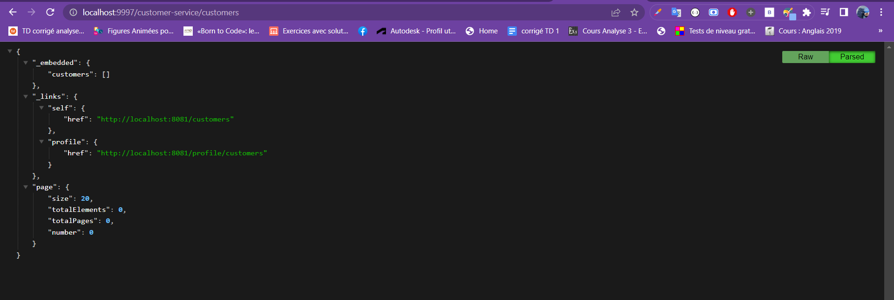

## Création du microservice 

### Stack & packages
```
java : 17-Maven
spring : 2.7.5
packages : 
    - spring-boot-starter-data-jpa
    - com.h2database/h2
    - spring-cloud-config-client  #get config from config-service
    -spring-cloud-starter-consul-discovery #register to consul
    - spring-boot-starter-actuator   
    -spring-data-rest
    - org.projectlombok/lombok : 1.18.24
```
-> Have a look : [📦 pom.xml ](./pom.xml)

<br>

### Config :
-> project configuration : `application.properties`

```
spring.application.name=customer-service
server.port=8081
spring.datasource.url=jdbc:h2:mem:e-bank-customer
spring.h2.console.enabled=true
spring.config.import= optional:configserver:http://localhost:8888
```
<br>

### App:

## Data Layer
 * `Customer` : Entity
```
@Entity
@AllArgsConstructor
@NoArgsConstructor
@Data
@Builder
public class Customer implements Serializable {
    @Id
    @GeneratedValue(strategy = GenerationType.IDENTITY)
    private Long id;
    private String name;
    private String email;
    private String phone;
}
```
[📦 Customer.java ](./src/main/java/ma/enset/customerservice/entities/Customer.java)

 * `CustomerRepository` :  a Rest Repository
```
@RepositoryRestResource
public interface CustomerRepository extends JpaRepository<Customer, Long> {
}
```
[📦 CustomerRepository.java ](./src/main/java/ma/enset/customerservice/repositories/CustomerRepository.java)

  *'CustomerProjection' : Projection
```
@Projection(name = "fullCustomer",types = Customer.class)
public interface CustomerInfo {
    Long getId();
    String getName();
    String getEmail();
}
```
[📦 CustomerInfo.java ](./src/main/java/ma/enset/customerservice/projections/CustomerInfo.java)


## Test App:
```
-> run config-service
->run discovery-service
->run gateway-service
->run customer-service 

```
<br>
<p align="center">
    
</p>
