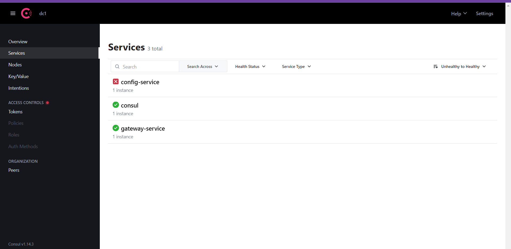

## Créeation du Gateway Service

## Stack & packages
-> Have a look : [📦 pom.xml ](./pom.xml)

```
java : 17-Maven
spring : 2.7.5
packages : 
    -spring-boot-starter-gateway
    - spring-boot-starter-actuator
    -spring-cloud-config-client
    -spring-cloud-starter-consul-discovery   
```

## Config :
-> project configuration : `application.properties`

``` 
server.port=9997
spring.application.name=gateway-service
spring.config.import= optional:configserver:http://localhost:votre_port
``` 

## App:
-> Cette application est une seule classe qui contient le bean de DiscoveryClientRouteDefinitionLocator  qui gerer les routes dynamiquement

```
@SpringBootApplication
public class GatewayServiceApplication {

	public static void main(String[] args) {
		SpringApplication.run(GatewayServiceApplication.class, args);
	}
	@Bean
	DiscoveryClientRouteDefinitionLocator discoveryClientRouteDefinitionLocator(ReactiveDiscoveryClient rdc, DiscoveryLocatorProperties dlp){
		return new DiscoveryClientRouteDefinitionLocator(rdc,dlp);
	}
}
```

## Test

```
-> run config-service
->run discovery-service
->run gateway-service 
```
<br>
<p align="center">
    
</p>


