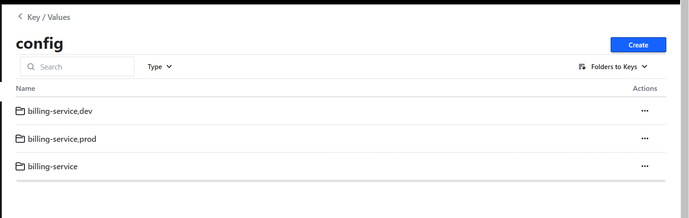
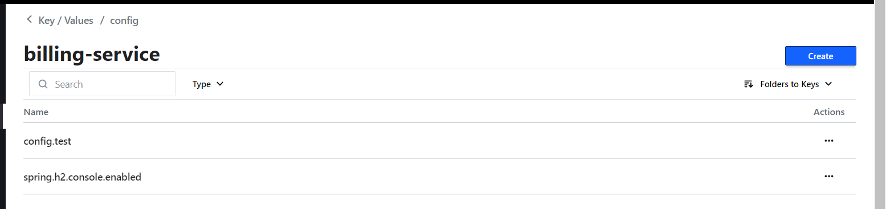

# Architectures Micro services avec (Spring Cloud Config, Consul Discovery, Consul Config,Vault)

                         Use case : Creation of e-commerce application based on micro-service Architecture

## Quick notes
>project element :1. Consul Discovery - Spring Cloud Config -Spring Cloud Gateway -Customer-service- Inventory Service -Order Service-Consul Config (Billing Service) -Vault (Billing Service) - Frontend Web avec Angular

## Project architecture


<br>

## Project report

## Creating the micro-services

[👉 Creating config -service ](./config-service/)


[👉 Creating Customer micro-service ](./customer-service)


[👉 Creating inventory micro-service](./inventory-service/)


[👉 Creating Billing micro-service](./billing-service)


[👉 Creating GateWay micro-service ](./gateway-service/)

[👉 Creating order service](./order-service)

<br>

# Installation & Use of consul


```
> Download consul from [here](https://www.consul.io/downloads.html)
> Extract and excute with command : consul agent -server -bootstrap-expect=1 -data-dir=consul-data -ui -bind=IPADDRESS_OF_YOUR_PC
> Get access to consul on localhost with port 8500 by default 
```
<p align="center">
    
</p>

<br>

* Use of consul discovery service to register micro-services to consul

> run consul 
>a. Add to pom.xml
```
<dependency>
			<groupId>org.springframework.cloud</groupId>
			<artifactId>spring-cloud-starter-consul-discovery</artifactId>
</dependency>
```

* Use of Consul Config to get config from consul -hot reload without restarting the app and manually actuator refresh

> run consul
> a. Add to pom.xml
```
<dependency>
            <groupId>org.springframework.cloud</groupId>
            <artifactId>spring-cloud-starter-consul-config</artifactId>
</dependency>
```

> b. Add to application.properties

```
spring.config.import=optional:consul:
```
> c.Creation of config files on consul with key/value pairs

<p align="center">
    
</p>

<br>

<p align="center">
    
</p>

[👉 Test on billing-service](./billing-service/Readme.md)


# Installation & Use of vault = management of secrets

```
> Download vault from [here](https://www.vaultproject.io/downloads)
> Extract and excute with command : vault server -dev
> Get access to vault on localhost with port 8200 by default 
```

* Run mode dev : vault server -dev

* get acces to vault with token : vault login

<p align="center">
    
</p>

<br>

[👉 Test on billing-service](./billing-service/Readme.md)


