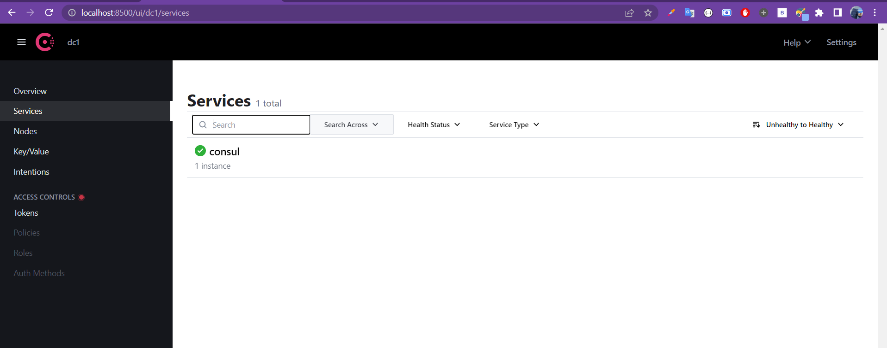

# create a micro-service architecture with hot configuration

                         Use case : Creation of e-commerce application based on micro-service Architecture

## Quick notes
>project element :1. Consul Discovery - Spring Cloud Config -Spring Cloud Gateway -Customer-service- Inventory Service -Order Service-Consul Config (Billing Service) -Vault (Billing Service) - Frontend Web avec Angular

## Project architecture


<br>

## Project report

## Creating the micro-services

[👉 Creating config -service (& dockerizing it)](./config-service/)


[👉 Creating Customer micro-service (& dockerizing it)](./customer-service)


[👉 Creating inventory micro-service (& dockerizing it)](./inventory-service/)


[👉 Creating Billing micro-service (& dockerizing it)](./billing-service)


[👉 Creating GateWay micro-service (& dockerizing it)](./gateway-service/)

[👉 Creating order service (& dockerizing it)](./order-service)

<br>

# Installation & Starting of consul

```
> Download consul from [here](https://www.consul.io/downloads.html)
> Extract and excute with command : consul agent -server -bootstrap-expect=1 -data-dir=consul-data -ui -bind=IPADDRESS_OF_YOUR_PC
> Get access to consul on localhost with port 8500 by default 
```
<p align="center">
    
</p>

<br>


