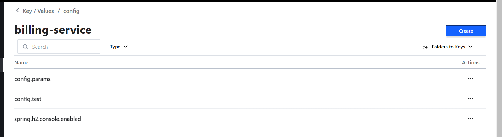
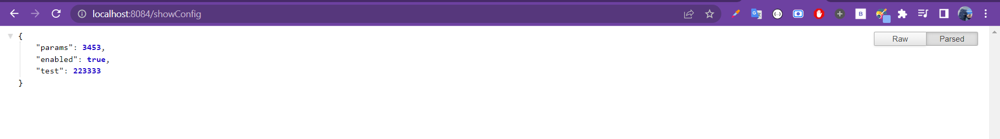
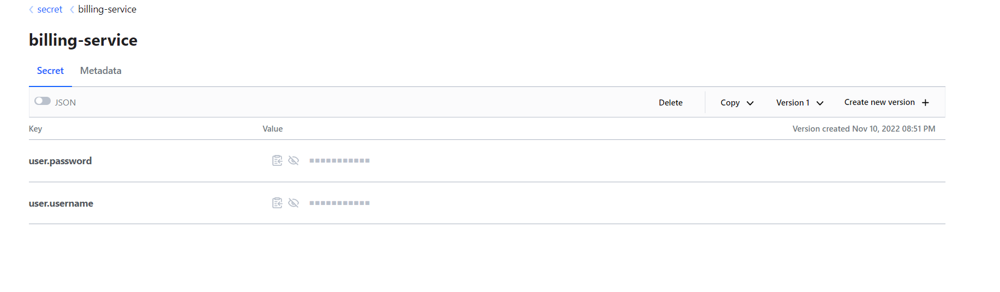
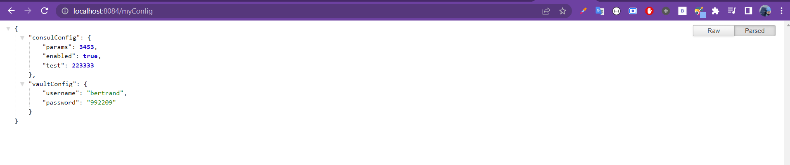
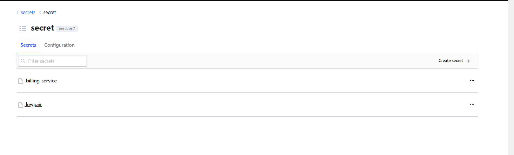

# Create Billing micro-service == Implementation of Consul Configuration & Vault config
<br>

## Stack & packages :
```
java : 17-Maven
spring : 2.7.5
packages : 
    - spring cloud : 2021.0.4
    - spring-cloud-starter-consul-config
    -spring-cloud-starter-vault-config
    -spring-cloud-starter-consul-discovery #register to consul
    - spring-boot-starter-actuator   
    - org.projectlombok/lombok : 1.18.24
    
```
-> Have a look : [📦 pom.xml ](./pom.xml)

<br>

## Config :
-> project configuration : `application.properties`
```
spring.application.name=billing-service
server.port=8084
spring.cloud.vault.token=TOKEN_FROM_VAULT
spring.cloud.vault.scheme=http
spring.cloud.vault.kv.enabled=true
spring.config.import=optional:consul:, vault:// 
management.endpoints.web.exposure.include=*
```
-> Have a look : [⚙ application.properties ](./src/main/resources/application.properties)

<br>

## Application report :

<br>

# Consul config :

* Creation of properties in consul :

<p align="center">
    
</p>

<br>

* Get the properties from consul :
> config file
```
@Component
@Data
public class ConsulConfig {
    @Value("${config.params}")
    private long params;
    @Value("${spring.h2.console.enabled}")
    private boolean enabled;
    @Value("${config.test}")
    private long test;
}
```
-> Have a look : [config.ConsulConfig ](./src/main/java/ma/enset/billingservie/config/ConsulConfig.java)
> RestController

```
@RestController
@RequiredArgsConstructor
public class SwohConfigController {

    private final ConsulConfig consulConfig;

    @GetMapping("/showConfig")
    public ConsulConfig showConfig() {
        return consulConfig;
    }


}
```
-> Have a look : [Restcontroler ](./src/main/java/ma/enset/billingservice/web/SwohConfigController.java)
    

* Test App :

<p align="center">
    
</p>

<br>

# Vault Service:

* add to pom.xml 

```
spring-cloud-starter-vault-config
```

* Creation of properties in vault :

<p align="center">
    
</p>

<br>

* Get the properties from vault :

> config file
```
@Component
@ConfigurationProperties(prefix = "user")
@Data
public class MyVaultConfig {
    private String username;
    private String password;
}

```
-> Have a look : [config.VaultConfig ](./src/main/java/ma/enset/billingservie/config/MyVaultConfig.java)

> RestController

```

@RestController
@RequiredArgsConstructor
public class SwohConfigController {

    private final ConsulConfig consulConfig;
    private final MyVaultConfig myVaultConfig;

    @GetMapping("/myConfig")
    public Map<String,Object> myConfig(){
        return Map.of("consulConfig",consulConfig, "vaultConfig",myVaultConfig);
    }

}


```

* Test App : need a make request to update params value

<p align="center">
    
</p>

<br>

## Share secret on boot with vault : VaultTemplate

```
@SpringBootApplication
public class BillingServiceApplication {
@Autowired
private VaultTemplate vaultTemplate;
public static void main(String[] args) {
SpringApplication.run(BillingServiceApplication.class, args);
}
@Bean
CommandLineRunner commandLineRunner(){
return args -> {
vaultTemplate.opsForVersionedKeyValue("secret")
.put("keypair", Map.of("privKey","54321","pubKey","8999"));
};
};

}

```
<p align="center">
    
</p>

<br>

