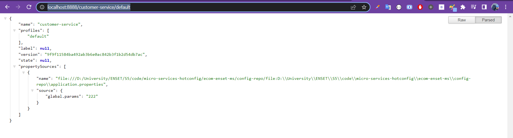
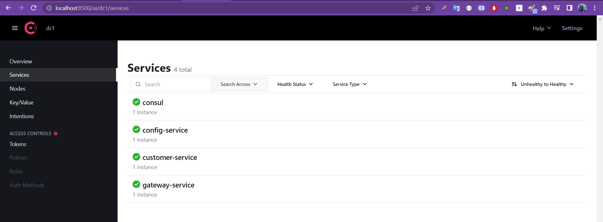

# Config Service

<br>

## Stack & packages

```
java : 17-Maven
spring : 2.7.5
packages : 
    - spring cloud : 2021.0.4
    - spring-boot-starter-actuator
    -spring-cloud-config-server
    -spring-cloud-starter-consul-discovery
    
```
-> Have a look : [📦 pom.xml ](./pom.xml)

<br>
## Config :

-> project configuration : `application.properties`

```
server.port=8888
spring.application.name=config-service
# created a git repository in the local machine and added the config files(not in project files)
spring.cloud.config.server.git.uri=file:///...
```
[⚙ application.properties ](./src/main/resources/application.properties)

<br>

##App :

-> project main class : It is a single class with @en=ableConfigServer annotation 

```
@SpringBootApplication
@EnableConfigServer
public class ConfigServiceApplication {

	public static void main(String[] args) {
		SpringApplication.run(ConfigServiceApplication.class, args);
	}

}
```
[📦 ConfigServiceApplication.java ](./src/main/java/com/example/configservice/ConfigServiceApplication.java)


# Test the app :

-> get customer-service config file from config-service

```
curl http://localhost:8888/customer-service/default
```
* after starting the app, open http://localhost:8888

<p align="center">
    
</p>

<br>

* after starting the app to get it registred on consul, you can test it with postman or curl :

<p align="center">
    
</p>

<br>
