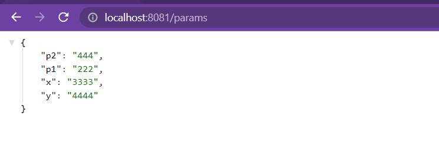

# Create customer micro-service
[]: # Author: [kafando Bertrand]
<br>

## Stack & packages :
```
java : 17-Maven
spring : 2.7.5
packages : 
    - spring cloud : 2021.0.4
    - spring-boot-starter-data-jpa
    - com.h2database/h2
    - spring-cloud-config-client  #get config from config-service
    -spring-cloud-starter-consul-discovery #register to consul
    - spring-boot-starter-actuator   
    -spring-data-rest
    - org.projectlombok/lombok : 1.18.24
    - org.springdoc/springdoc-openapi-ui : 1.6.11
```
-> Have a look : [📦 pom.xml ](./pom.xml)

<br>

## Config :
-> project configuration : `application.properties`
```
spring.application.name=customer-service
server.port=8081
spring.datasource.url=jdbc:h2:mem:e-bank-customer
spring.h2.console.enabled=true
```
-> Have a look : [⚙ application.properties ](./src/main/resources/application.properties)

<br>
## Application : 

##test of configuration service

```
@RestController
@RefreshScope
public class CustomerConfigTestController {
    @Value("${global.params.p1}")
    private String p1;
    @Value("${global.params.p2}")
    private String p2;
    @Value("${customer.params.x}")
    private String x;
    @Value("${customer.params.y}")
    private String y;

    @GetMapping("/params")
    public Map<String, String> params() {
        return Map.of("p1", p1, "p2", p2, "x", x, "y", y);
    }
}
```
[📦 CustomerConfigTestController.java ](./src/main/java/com/example/customerservice/CustomerConfigTestController.java)

<br>


## Test locally :
-> get customer-service config file from config-service
```
curl http://localhost:8888/customer-service/default
```
* after starting the app, open http://localhost:8081/params

<p align="center">
    
</p>

<br>

*  Hot reload : after changing config make actuator refresh to get the new config
```
curl -X POST http://localhost:8081/actuator/refresh
```


## Customer Service

### Data Layer

* one single entity : Customer
```
@Entity
@AllArgsConstructor
@NoArgsConstructor
@Data
@Builder
public class Customer implements Serializable {
    @Id @GeneratedValue(strategy = javax.persistence.GenerationType.IDENTITY)
    private Long id;
    private String name;
    private String email;
    private String phone;
}
```
[📦 Customer.java ](./src/main/java/com/example/customerservice/entities/Customer.java)

<br>

* a data rest respository : CustomerRepository
```
@RepositoryRestResource
public interface CustomerRepository extends JpaRepository<Customer, Long> {
}
```
[📦 CustomerRepository.java ](./src/main/java/com/example/customerservice/repositories/CustomerRepository.java)

<br>
*  a customer projection : CustomerProjection

```
@Projection(name = "fullCustomer",types = Customer.class)
public interface CustomerInfo {
    Long getId();
    String getName();
    String getEmail();
}
```
[📦 CustomerInfo.java ](./src/main/java/com/example/customerservice/projections/CustomerInfo.java)

<br>
