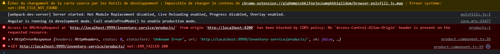
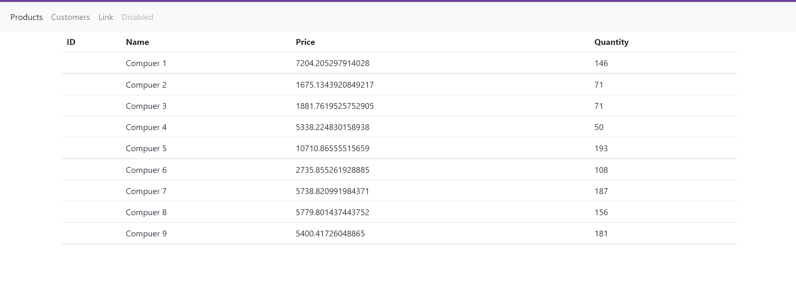
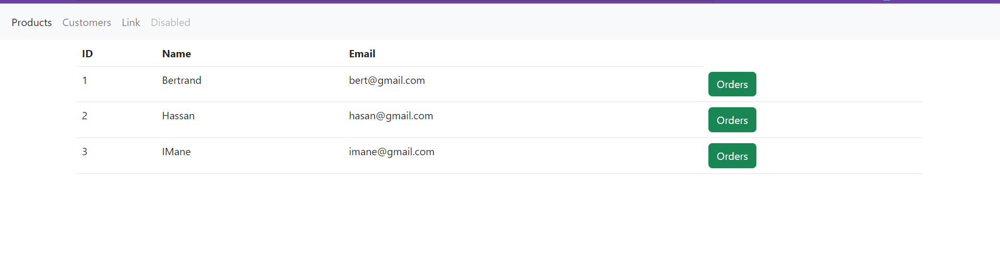

# EcomWebApp

This project was generated with [Angular CLI](https://github.com/angular/angular-cli) version 14.2.3.

## Development server

Run `ng serve` for a dev server. Navigate to `http://localhost:4200/`. The application will automatically reload if you change any of the source files.

## Code scaffolding

Run `ng generate component component-name` to generate a new component. You can also use `ng generate directive|pipe|service|class|guard|interface|enum|module`.

## Build

Run `ng build` to build the project. The build artifacts will be stored in the `dist/` directory.

## Running unit tests

Run `ng test` to execute the unit tests via [Karma](https://karma-runner.github.io).

## Application report

# Install dependencies : npm install
 > add bootstrap : npm install bootstrap
  > add font-awesome : npm install font-awesome
 > add  "node_modules/bootstrap/dist/css/bootstrap.min.css" to angular.json

# Create a new Module : ng g m ....
 > create modules/ecom/ecom.module.ts (190 bytes)
 > update src/app/app.module.ts (1009 bytes)
# Create a new component : ng g c components/your-component-name --skip-tests


## Products

> model

```
export class Product {
  id ?: number;
  name?: string;
  price?: number;
  quantity?: number;
}

```
<br>

> Service : [ click here ](./src/app/services/product.service.ts)

> Component : [ click here ](./src/app/components/products)

> Routing : [ click here ](./src/app/modules/ecom/ecom-routing.module.ts)

> cors Error
<p align="center">
    
</p>

<br>

> Fix cors Error: Add yml config file to the gateway service
```
spring:
  cloud:
    gateway:
      globalcors:
        corsConfigurations:
          '[/**]':
            allowedOrigins: "http://localhost:4200"
            allowedHeaders: "*"
            allowedMethods:
              - GET
              - POST
              - PUT
              - DELETE
              - OPTIONS 
```
<br>

> Get products

<p align="center">
    
</p>

## Customers

> model

```
export class Customer {
    id?: number;
    name?: string;
    email?: string;
    phone?: string;
}
```
<br>

> Service : [ click here ](./src/app/services/customer.service.ts)
> Component : [ click here ](./src/app/components/customers)
> 
<br>

<p align="center">
    
</p>

<br>


## Customers-> Orders


## Orders-details
