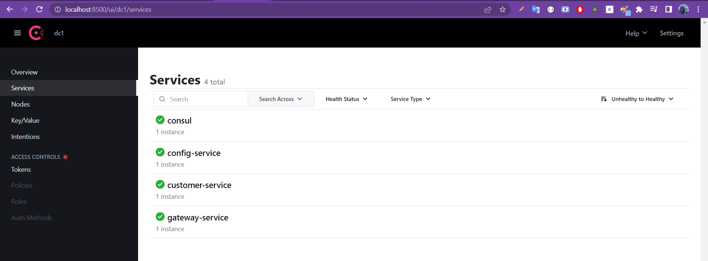

# Create GateWay service-Dynamic routing configuration

<br>

## stack & packages :

```
java : 17-Maven
spring : 2.7.5
packages : 
    - spring cloud : 2021.0.4
    - spring-cloud-starter-gateway
    - spring-cloud-config-client  #get config from config-service
    -spring-cloud-starter-consul-discovery #register to consul
    - spring-boot-starter-actuator
```
-> Have a look : [📦 pom.xml ](./pom.xml)

<br>

## Config :

-> project configuration : `application.properties`

```
server.port=9999
spring.application.name=gateway-service


```
[⚙ application.properties ](./src/main/resources/application.properties)

<br>

## App :

* This app has one single class, main class, it contains a bean to instanciate a `DiscoveryClientRouteDefinitionLocator` that is responsible for the dynamique routing of each microservice declared on eureka :

```
@SpringBootApplication
public class GatewayServiceApplication {

	public static void main(String[] args) {
		SpringApplication.run(GatewayServiceApplication.class, args);
	}
	@Bean
	DiscoveryClientRouteDefinitionLocator discoveryClientRouteDefinitionLocator(ReactiveDiscoveryClient rdc, DiscoveryLocatorProperties dlp){
		return new DiscoveryClientRouteDefinitionLocator(rdc,dlp);
	}
}

```

<br>


# Test the app :

* after starting the app to get it registred on consul, open http://localhost:9999

<p align="center">
    
</p>


<br>
