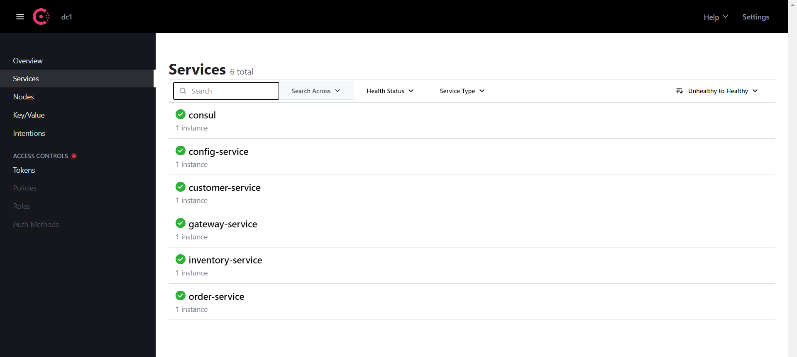
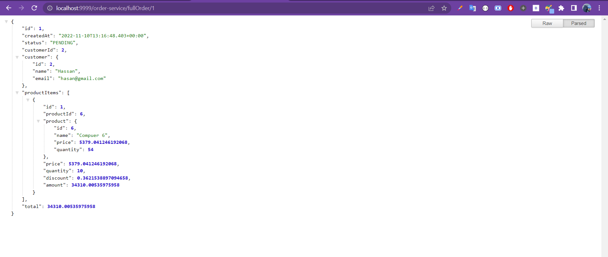

# Create order micro-service
<br>

## Stack & packages :
```
java : 17-Maven
spring : 2.7.5
packages : 
    - spring cloud : 2021.0.4
    - spring-boot-starter-data-jpa
    - com.h2database/h2
    - spring-cloud-config-client  #get config from config-service
    -spring-cloud-starter-consul-discovery #register to consul
    - spring-boot-starter-actuator   
    -spring-data-rest
    - org.projectlombok/lombok : 1.18.24
    - spring-boot-starter-hateoas
    -spring-cloud-starter-openfeign
    -
```
-> Have a look : [📦 pom.xml ](./pom.xml)

<br>

## Config :
-> project configuration : `application.properties`
```
spring.application.name=order-service
server.port=8083
spring.datasource.url=jdbc:h2:mem:e-bank-order
spring.h2.console.enabled=true
```
-> Have a look : [⚙ application.properties ](./src/main/resources/application.properties)

<br>

## Application report :


# Test the app :

* after starting the app to get it registred on consul, you can test it with postman or curl :

<p align="center">
    
</p>
<br>
* The gateway routes successfully the request :

<p align="center">
    
</p>

<br>


## Feign Logs

* add to properties file :
```
logging.level.ma.enset.orderservice.services.CustomerRestClientService=debug
logging.level.ma.enset.orderservice.services.InventoryRestClientService=debug
feign.client.config.default.loggerLevel=full
```
* run the app and check the logs :
```
 {
  "_embedded" : {
    "customers" : [ {
      "name" : "Bertrand",
      "id" : 1,
      "email" : "bert@gmail.com",
      "_links" : {
        "self" : {
          "href" : "http://localhost:8081/customers/1"
        },
        "customer" : {
          "href" : "http://localhost:8081/customers/1{?projection}",
          "templated" : true
        }
      }
    }, {
      "name" : "Hassan",
      "id" : 2,
      "email" : "hasan@gmail.com",
      "_links" : {
        "self" : {
          "href" : "http://localhost:8081/customers/2"
        },
        "customer" : {
          "href" : "http://localhost:8081/customers/2{?projection}",
          "templated" : true
        }
      }
    }, {
      "name" : "IMane",
      "id" : 3,
      "email" : "imane@gmail.com",
      "_links" : {
        "self" : {
          "href" : "http://localhost:8081/customers/3"
        },
        "customer" : {
          "href" : "http://localhost:8081/customers/3{?projection}",
          "templated" : true
        }
      }
    } ]
  },
  "_links" : {
    "self" : {
      "href" : "http://localhost:8081/customers?projection=fullCustomer"
    },
    "profile" : {
      "href" : "http://localhost:8081/profile/customers"
    }
  },
  "page" : {
    "size" : 20,
    "totalElements" : 3,
    "totalPages" : 1,
    "number" : 0
  }
}
```

