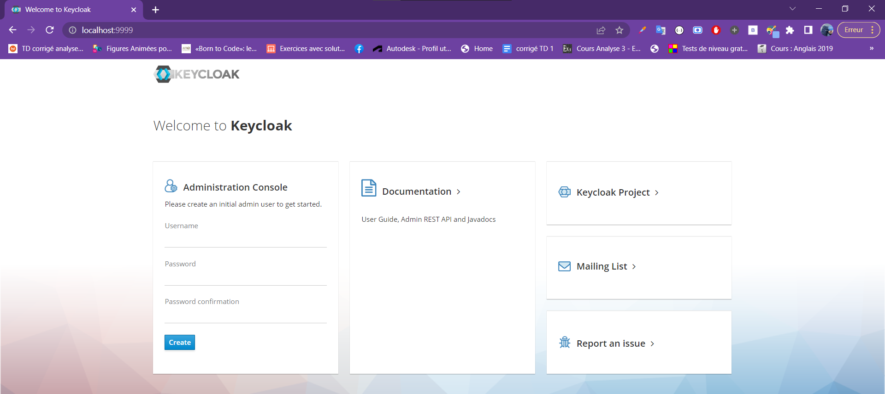

#Activité pratique N° 4 : Sécurité des micro services avec Keycloak


                            Partie 1: Installation de Keycloak et Configuration

# 1.Télécharger Keycloak 19

```
Telecharger sur [->] (!https://www.keycloak.org/downloads)
Extraire 
```

# 2.Démarrer Keycloak

```
Excecuter la commande :  kc.bat start-dev --http-port=9999
ici je change le port car  8080  est déjà occupé
```


# 3.Créer un compte Admin

```
Au premier demarrage, keycloak demande de creer un administrateur.
Après creation, nous pouvons acceder à la console d'administration en s'authentifiant
```


# 4.Créer une Realm
```
Création du realm test-realm
```


# 5.Créer un client à sécuriser
```
Les clients sont les applications à sécurisés
```


# 6.Créer des utilisateurs

```
```


# 7.Créer des rôles
```
```


# 8.Affecter les rôles aux utilisateurs
```
```


# 9.Avec PostMan :

```
> Tester l'authentification avec le mot de passe
on utilise le lien  du token endpoint  -> http://localhost:9999/realms/test-realm/protocol/openid-connect/token
```


```
> Analyser les contenus des deux JWT Access Token et Refresh Token
on 03 grandes parties 
#l'entete:

#le payload qui contient les informations sur le token
sub-> userId
realm_access -> les roles
temps d'expriration
...

#verification de la signature
```


```
> Tester l'authentification avec le Refresh Token
on change le type du granr_type en refresh_token et on envoie un refresh_oken
```


```
> Tester l'authentification avec Client ID et Client Secret
Il identifie l'application et non le user
generealement pour les clients backend
 ->activer client authentification
 ->changer le type de grant_type 
 -> et envoyer client secret
```

```
> Changer les paramètres des Tokens Access Token et Refresh Token
 ->allez dans Realm Settings
 ->Allez token 
``` 

