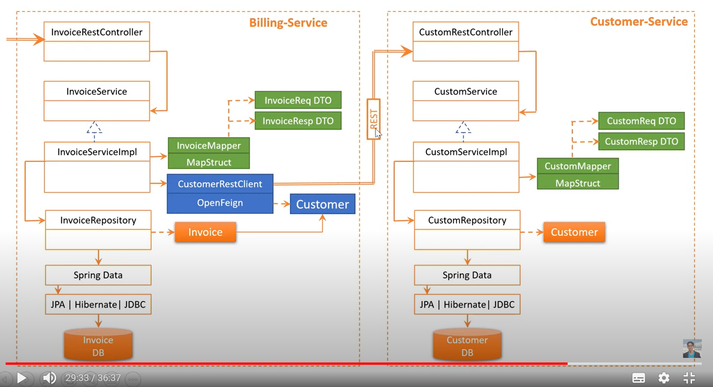
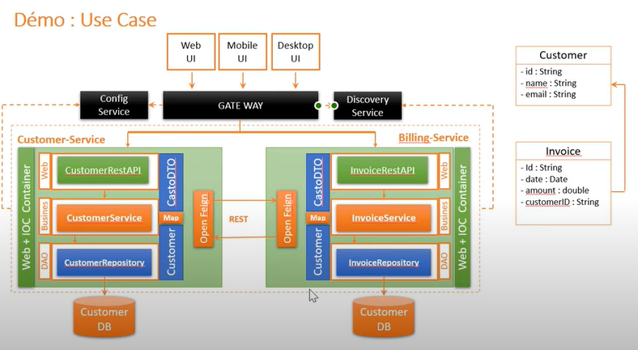
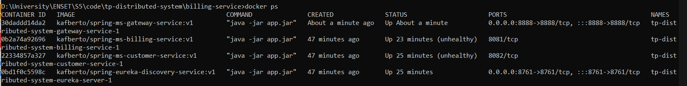
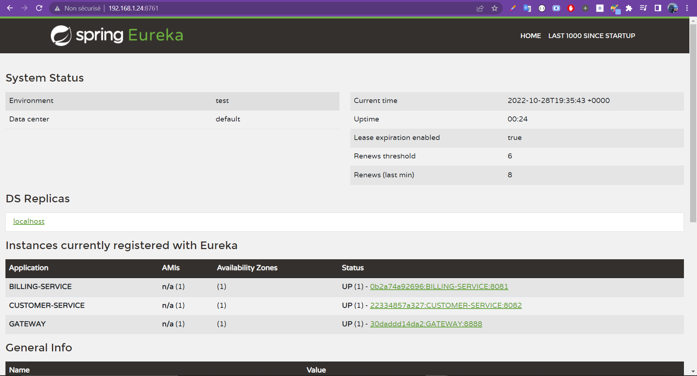
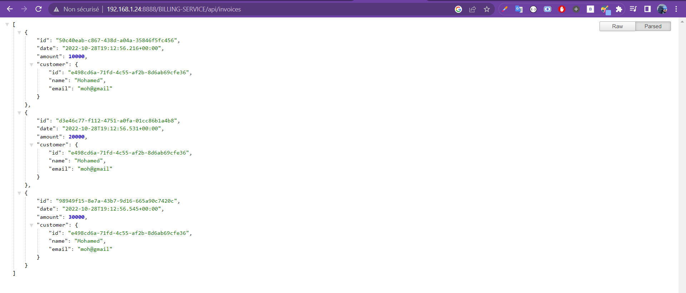

# Communicating microservices using eureka (REST apis) With  a gateway

## Quick notes

> for this project, you'll have to start these apps in the order : eureka server -> customer-service -> billing-service -> gateway. <br> this is because the billing service needs to query some data from customer service, and both of them need to be registered on eureka.

⭐ have a look on exceptions management and Http codes returning.

<br>

##  Project architecture :



<br>



<br>
<br>

# Project repport

## Creating microservices

[👉 Creating Eureka discovery service/micro-service (& dockerizing it)](./eureka-discovery-service)


[👉 Creating Customer micro-service (& dockerizing it)](./customer-service)


[👉 Creating Billing micro-service (& dockerizing it)](./billing-service)


[👉 Creating GateWay micro-service (& dockerizing it)](./gateway-service/)

<br>

## Running microservices on docker compose :

The [Docker-compose.yaml](./Docker-compose.yaml) is configured properly to run all the microservices together, note that microservices `CUSTOMER-SERVICE` and `BILLING-SERVICE` are not accessible directly, you need either to uncomment port mapping or pass through gateway, ex : http://192.168.1.24:8888/CUSTOMER-SERVICE/api/customers

> `docker-compose up`
<br>



<br>

## Test Docker :

>Gateway



>Billing service




## Running microservices on kubernetes (K8s) :

<br>

> if you're working with minikube you may need to pull images locally first example `minikube image pull kafberto/spring-ms-billing-service:v1`

> after staring the k8s cluster i applied these config files in order to create  :
```
$ kubectl apply -f ./k8s/eureka-discovery-service.yaml
$ kubectl apply -f ./k8s/customer-service.yaml
$ kubectl apply -f ./k8s/billing-service.yaml
$ kubectl apply -f ./k8s/gateway-service.yaml

#   => to create 
# {
#  1: eureka pod
#  1: gateway pod
#  2: customer pods
#  2: billing pods
# }

```

