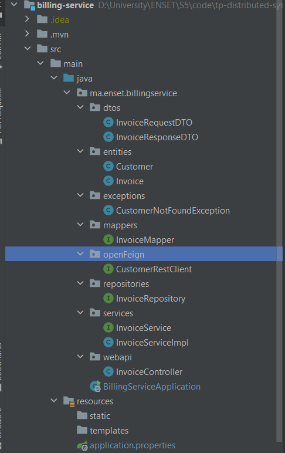
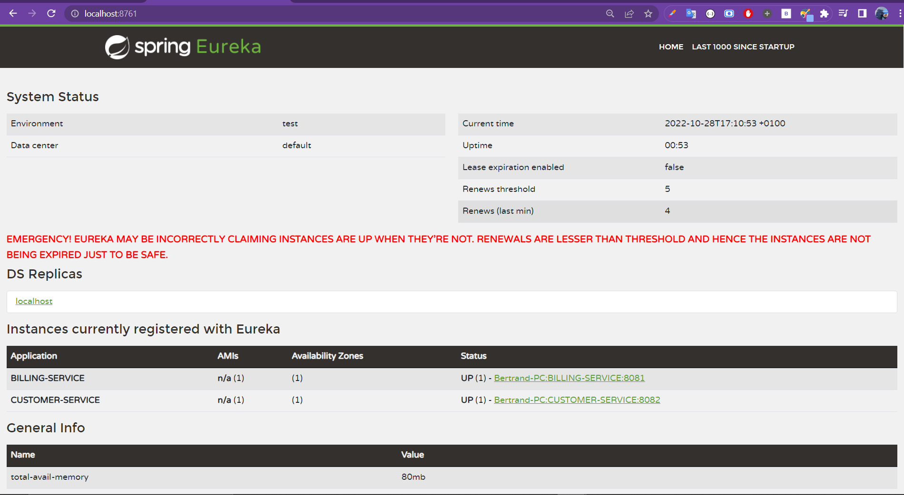
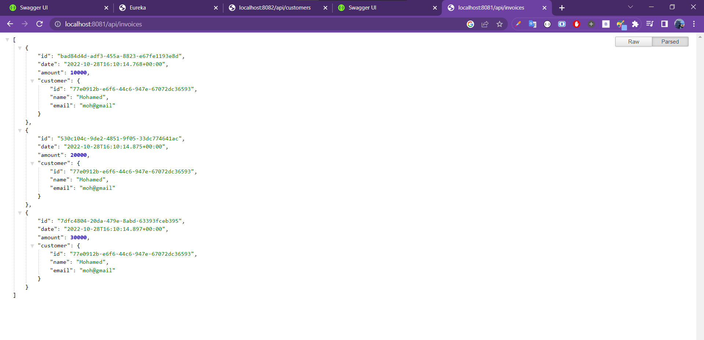
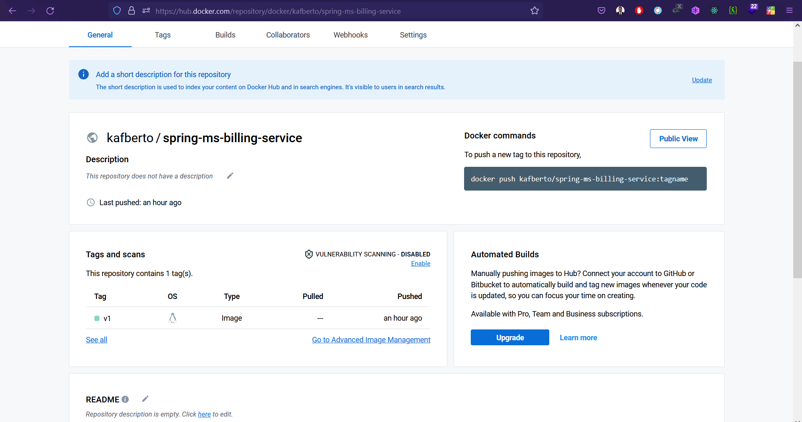

# Create Billing/invoices micro-service

<br>

## Stack & packages :
```
java : 17-Maven
spring : 2.7.5
packages : 
    - spring cloud : 2021.0.4
    - spring-boot-starter-data-jpa
    - spring-cloud-starter-netflix-eureka-client
    - spring-cloud-starter-openfeign
    - com.h2database/h2
    - spring-boot-starter-web
    - org.mapstruct/mapstruct-processor : 1.5.3.Final
    - org.projectlombok/lombok : 1.18.24
    - org.springdoc/springdoc-openapi-ui : 1.6.11
```
-> Have a look : [📦 pom.xml ](./pom.xml)

<br>

## Config :

### -> Project configuration : `application.properties`

```
spring.datasource.url=jdbc:h2:mem:e-bank-billing
spring.h2.console.enabled=true
server.port=8081
spring.application.name=BILLING-SERVICE
spring.cloud.discovey.enabled=true
euraka.instance.prefer-ip-address=true  

```
[⚙ application.properties ](./src/main/resources/application.properties)

<br>

## Application :

### ℹ Project structure ;

<p align="center">
    
</p>

<br>


### 💻 Data Layer :

* one single data-jpa entity : `~/entities/Invoice`

```
@Entity
@Data
@NoArgsConstructor
@AllArgsConstructor
public class Invoice {
    @Id
    private String id;
    private Date date;
    private BigDecimal amount;
    private String customerID;
    @Transient
    private Customer customer;
}

```

* with another non data-jpa entity : `~/entities/Customer`

```
@Data
@AllArgsConstructor
@NoArgsConstructor
public class Customer {
    private String id;
    private String name;
    private String email;
}

```


* One single repository (interface) : `~/repositories/InvoiceRepository`

```
@Repository
public interface InvoiceRepository extends JpaRepository<Invoice, String> {
    List<Invoice> findByCustomerID(String customerID);
}

```
<br>


### 🔁 BusinessLogic Layer :

<br>

#### 1. services :

* Customer service interface : `~/services/InvoiceService.java` :
```
@Service
public interface InvoiceService {
    InvoiceResponseDTO save(InvoiceRequestDTO invoiceDto);
    InvoiceResponseDTO getInvoiceById(String id);
    InvoiceResponseDTO update(String id, InvoiceRequestDTO invoiceDto);
    boolean delete(String id);
    List<InvoiceResponseDTO> getInvoices();
    List<InvoiceResponseDTO> getInvoicesByCustomerID(String customerID);
}

```
-> [implmentation of the interface : `InvoiceServiceImpl` ](./src/main/java/com/ebank/billing/services/InvoiceServiceImpl.java)

<br>

#### 2. DTOs :

> There are two DTOs kinds, for responses & for requests :

* request dto : `~/dtos/InvoiceRequestDTO.java` :
```
@Data
@AllArgsConstructor
@NoArgsConstructor
public class InvoiceRequestDTO {
    private BigDecimal amount;
    private String customerID;
}

```

* response dto : `~/dtos/responses/InvoiceResponseDTO.java` :
```
@Data
public class InvoiceResponseDTO {
    private String id;
    private Date date;
    private BigDecimal amount;
    private Customer customer;
}

```

<br>

#### 3. Mappers :

* a mapstruct mapper : `~/mappers/InvoiceMapper.java`

```
@Mapper(componentModel = "spring")
public interface InvoiceMapper {
    Invoice invoiceRequestDtoToInvoice(InvoiceRequestDTO invoiceDto);
    InvoiceResponseDTO invoiceToInvoiceResponseDto(Invoice invoice);
}

```

<br>

#### 4. Exceptions :

* A customer not found exception : `~/exceptions/CustomerNotFoundException.java`

```
public class CustomerNotFoundException extends RuntimeException {
    public CustomerNotFoundException(String message) {
        super(message);
    }

}

```

<br>

#### 5. Open Feign Client :

* in order to fetch customers data from `CUSTOMER-SERVICE`, i've created this openfeign interface whit the ability to call two apis : `~/openfeign/CustomerRestClient`

```
@FeignClient(name = "CUSTOMER-SERVICE")
public interface CustomerRestClient {
    @GetMapping("/api/customers/{id}")
    Customer getCustomerById(@PathVariable String id);

    @GetMapping("/api/customers")
    List<Customer> allCustomers();
}

```

<br>


### 🌐 Web Layer :

* Web rest controller :  `~/web/InvoiceRestApi.java`

```

@RestController
@RequestMapping("/api")
@RequiredArgsConstructor
public class InvoiceController {
    final  private InvoiceService invoiceService;
    @GetMapping("/invoices/{id}")
    public InvoiceResponseDTO getInvoiceById(@PathVariable String id){
        return invoiceService.getInvoiceById(id);
    }

  ........

    @PostMapping("/invoices")
    public InvoiceResponseDTO save(@RequestBody InvoiceRequestDTO invoiceDto){
        return invoiceService.save(invoiceDto);
    }

    @ExceptionHandler(Exception.class)
    public ResponseEntity<String> handleException(Exception e){
        return new ResponseEntity<>(e.getMessage(), HttpStatus.INTERNAL_SERVER_ERROR);
    }

}

```
-> [Full code](./src/main/java/com/ebank/billing/web/InvoiceController.java)

<br>


### 🚀 main application :

* Main app class `~/BillingServiceApplication.java` contains along with server launch, a bean to insert some data to the H2 database and the annotation `@EnableFeignClients` to be able to use Feign :


```

@SpringBootApplication
@EnableFeignClients
public class BillingServiceApplication {

	public static void main(String[] args) {
		SpringApplication.run(BillingServiceApplication.class, args);
	}

	 @Bean
	 CommandLineRunner start(InvoiceService invoiceService, CustomerRestClient customerRestClient){
	 	return args -> {
			List<Customer> customers = customerRestClient.allCustomers();
			 invoiceService.save(new InvoiceRequestDTO(BigDecimal.valueOf(10000),customers.get(0).getId()));
			 invoiceService.save(new InvoiceRequestDTO(BigDecimal.valueOf(20000),customers.get(0).getId()));
			 invoiceService.save(new InvoiceRequestDTO(BigDecimal.valueOf(30000),customers.get(0).getId()));
	 		 invoiceService.getInvoices().forEach(System.out::println);
	 	};
	 }
}

```

<br>


## Test locally :


```
steps : 
    1. launch eureka service
    2. launch customer service
    3. launch this app ; billing
```

* published on eureka discovery :

<p align="center">
    
</p>


* Swagger docs :

<p align="center">
    
</p>

* example api call :

<p align="center">
    
</p>

<br>
<br>

# dockerize it :

[-> Docker file ](./Dockerfile)


> After packaging the app, you can build quicky with the command : ` Docker build -t kafberto/spring-ms-billing-service:v1 . `

```
FROM openjdk:17-alpine

# you need to compile & package your app before building a docker image !

ENV APP_HOME=/usr/app
WORKDIR $APP_HOME
COPY ./target/*.jar app.jar
EXPOSE 8081
CMD [ "java", "-jar", "app.jar"]
```

<p align="center">
    
</p>

[image on DockerHub](https://hub.docker.com/repository/docker/kafberto/spring-ms-billing-service)


<br>

```< end.```


