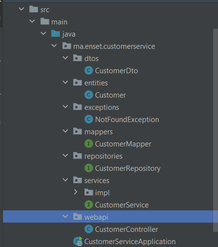
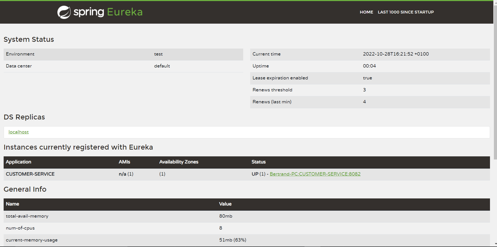
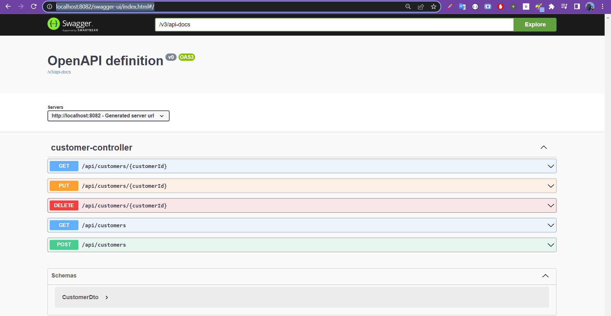
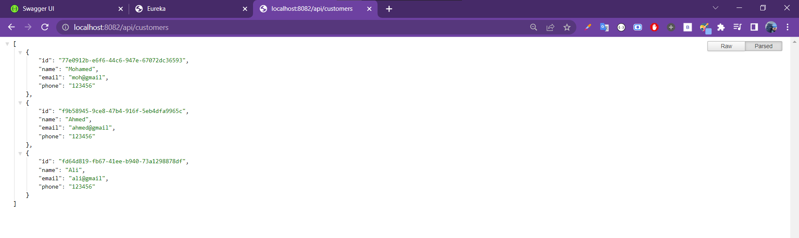
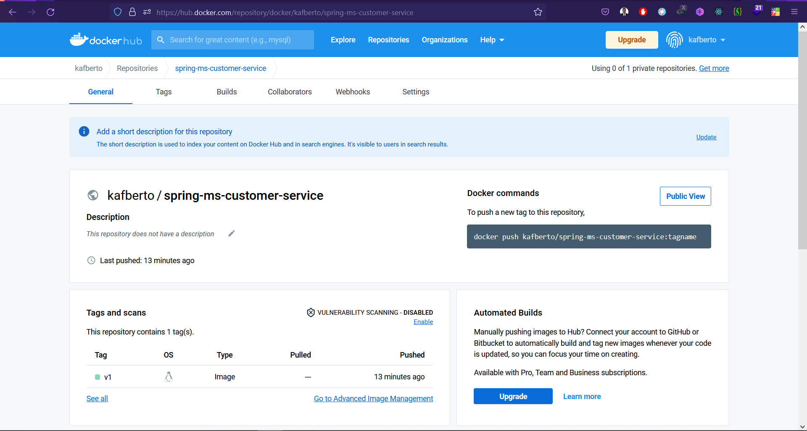

# Create customer micro-service
[]: # Author: [kafando Bertrand]
<br>

## Stack & packages :

```
java : 17-Maven
spring : 2.7.5
packages : 
    - spring cloud : 2021.0.4
    - spring-boot-starter-data-jpa
    - spring-cloud-starter-netflix-eureka-client
    - com.h2database/h2
    - spring-boot-starter-web
    - org.mapstruct/mapstruct-processor : 1.5.3.Final
    - org.projectlombok/lombok : 1.18.24
    - org.springdoc/springdoc-openapi-ui : 1.6.11
```
-> Have a look : [📦 pom.xml ](./pom.xml)

<br>

## Config :

### -> Project configuration : `application.properties`

```
spring.datasource.url=jdbc:h2:mem:e-bank-customer
spring.h2.console.enabled=true
server.port=8082
spring.application.name=CUSTOMER-SERVICE
spring.cloud.discovey.enabled=true
euraka.instance.prefer-ip-address=true  
```
[⚙ application.properties ](./src/main/resources/application.properties)

<br>

## Application : 
### ℹ Project structure ; 
<p align="center">
    
</p>

<br>
### 💻 Data Layer : 

* one single entity : `Customer` :
```
/* in : ~/entities/Customer.java  */

@Entity
@AllArgsConstructor
@NoArgsConstructor
@Data
public class Customer implements Serializable {
    @Id
    private String id;
    private String name;
    private String email;
    private String phone;
}

```
* One single repository (interface) : `CustomerRepository`

```
/* in : ~/repositories/CustomerRepository.java  */
@Repository
public interface CustomerRepository extends JpaRepository<Customer, String> {

}

```


### 🔁 BusinessLogic Layer :

<br>

#### 1. services : 

* Customer service interface : `~/services/CustomerService.java` :
```
public interface CustomerService {
CustomerDto getCustomerById(String id);
CustomerDto save(CustomerDto customerDto);
CustomerDto update(String id, CustomerDto customerDto);
boolean delete(String id);
List<CustomerDto> getCustomers();

}
```
-> [implmentation of the interface : `CustomerServiceImpl` ](./src/main/java/ma/enset/customerservice/services/impl/CustomerServiceImpl.java)

<br>

#### 2. DTOs :

* Customer DTO : `~/dto/CustomerDto.java` :
```
@Getter
@Setter
@AllArgsConstructor
@NoArgsConstructor
public class CustomerDto  {
    private  String id;
    private  String name;
    private  String email;
    private  String phone;
}

```

<br>

#### 3. Mappers :

* a mapstruct mapper : `~/mappers/CustomerMapper.java`

```
@Mapper(componentModel = "spring")
public interface CustomerMapper {
    CustomerDto customerToCustomerDto(Customer customer);
    Customer customerDtoToCustomer(CustomerDto customerDto);
}

```

<br>


#### 4. Exceptions :

* one single exception for a not found Element : `~/exceptions/NotFoundException.java`

```
public class NotFoundException extends Exception {
    private Long resourceId;
    public NotFoundException(String message) {
        super(message);
    }
    public NotFoundException(Long resourceId) {
        super();
        this.resourceId = resourceId;
    }

    @Override
    public String getMessage() {
        if (resourceId != null)
            return "Element with id '" + resourceId + "' not found";
        return super.getMessage();
    }
}

```
<br>

### 🌐 Web Layer :

* Web rest controller :  `~/webapi/CustomerController.java`

```
@RestController
@RequiredArgsConstructor
@Transactional
@RequestMapping("/api/customers")
public class CustomerController {
    final private CustomerService customerService;
    @PostMapping
    public CustomerDto save(@RequestBody CustomerDto customerDto){
        return customerService.save(customerDto);
    }
    @GetMapping
    public List<CustomerDto> getCustomers() throws NotFoundException {
        List<CustomerDto>customerDtos=customerService.getCustomers();
        if(customerDtos.isEmpty()) throw new NotFoundException("No customers found");
        return customerService.getCustomers();
    }
    @GetMapping("/{customerId}")
    public CustomerDto getCustomerById(@PathVariable String customerId) throws NotFoundException {
        CustomerDto customerDto=customerService.getCustomerById(customerId);
        if(customerDto==null) throw new NotFoundException("Customer with Id "+ customerId+ " not found");
        return customerDto;
    }
    @PutMapping("/{customerId}")
    public CustomerDto update(@PathVariable String customerId,@RequestBody CustomerDto customerDto) throws NotFoundException {
        CustomerDto customerUpdate=customerService.update(customerId,customerDto);
        if(customerUpdate==null) throw new NotFoundException("Customer with Id "+ customerId+ " not found");
        return customerUpdate;
    }
    @DeleteMapping("/{customerId}")
    public boolean delete(@PathVariable String customerId) throws NotFoundException {
        boolean deleted=customerService.delete(customerId);
        if(!deleted) throw new NotFoundException("Customer with Id "+ customerId+ " not found");
        return deleted;
    }

}

```
-> [Full code](./src/main/java/ma/enset/customerservice/web/CustomerController.java)

<br>


### 🚀 main application :

* Main app class `~/Ap1Application.java` contains along with server launch, a bean to insert some data to the H2 database :


```

@SpringBootApplication
public class CustomerServiceApplication {

	public static void main(String[] args) {
		SpringApplication.run(CustomerServiceApplication.class, args);
	}

	@Bean
	CommandLineRunner start(CustomerService customerService){
		return args -> {
			customerService.save(new CustomerDto("1","Mohamed","moh@gmail","123456"));
			customerService.save(new CustomerDto("2","Ahmed","ahmed@gmail","123456"));
			customerService.save(new CustomerDto("3","Ali","ali@gmail","123456"));
			customerService.getCustomers().forEach(System.out::println);
		};
	}
}

```

<br>

## Test locally :

```
steps : 
    1. launch eureka service
    2. launch this app
```


* published on eureka discovery :

<p align="center">
    
</p>


* Swagger docs :

<p align="center">
    
</p>

* example api call :

<p align="center">
    
</p>

<br>
<br>

# dockerize it :

[-> Docker file ](./Dockerfile)


> After packaging the app, you can build quicky with the command : ` Docker build -t kafberto/spring-ms-customer-service:v1 . `
FROM openjdk:17.0.2
```
ENV APP_HOME=/usr/app
WORKDIR $APP_HOME
COPY ./target/*.jar app.jar
EXPOSE 8082
CMD [ "java", "-jar", "app.jar"]
```

<p align="center">
    
</p>

Dockerhub : [kafberto/spring-ms-customer-service](https://hub.docker.com/repository/docker/kafberto/spring-ms-customer-service)

<br>

```< end.```
