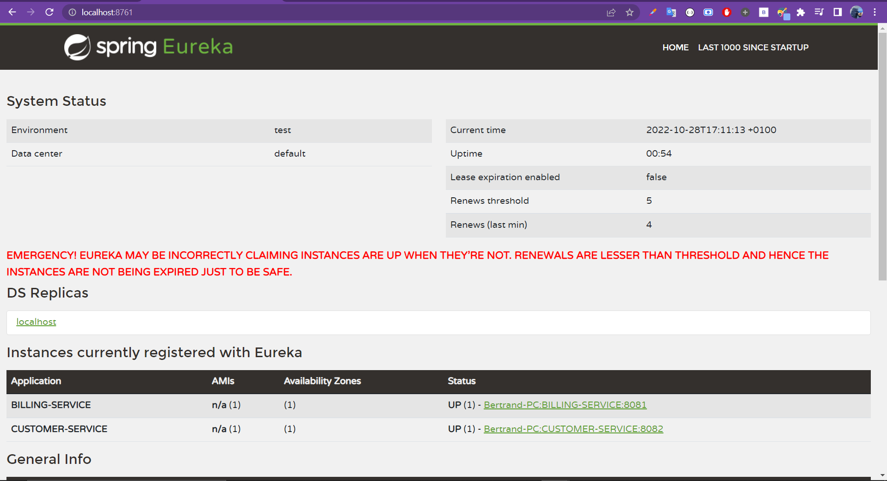
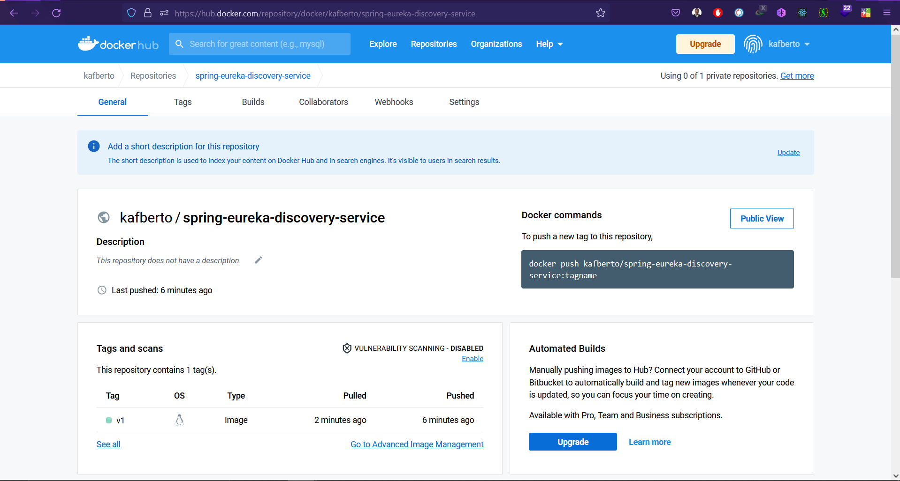

# Create eureka discovery service

<br>

## stack & packages :

```
java : 17-Maven
spring : 2.7.5
packages : 
    - spring cloud : 2021.0.4
    - spring-cloud-starter-netflix-eureka-server
```
-> Have a look : [📦 pom.xml ](./pom.xml)

<br>

## Config :

-> project configuration : `application.properties`

```
server.port=8761
#does not register itself in the eureka server
eureka.client.register-with-eureka=false
#dont register itself as a eureka client
eureka.client.fetch-registry=false
```
[⚙ application.properties ](./src/main/resources/application.properties)

<br>

## App :

* This app has one single class, main class, that creates eureka server (annotation) :

```

@SpringBootApplication
@EnableEurekaServer
public class EurekaDiscoveryServiceApplication {

	public static void main(String[] args) {
		SpringApplication.run(EurekaDiscoveryServiceApplication.class, args);
	}

}

```

# Test the app :

* after starting the app, open http://localhost:8761

<p align="center">
    
</p>

<br>

# Dockerizing the app :

> Quick dockerize it with : `Docker build -t kafberto/spring-eureka-discovery-service:v1 . `

* docker file : [`Dockerfile`](./Dockerfile)

```
FROM openjdk:17-alpine
ENV APP_HOME=/usr/app
WORKDIR $APP_HOME
COPY ./target/*.jar app.jar
EXPOSE 8761
CMD [ "java", "-jar", "app.jar"]

```


<p align="center">
    
</p>

[image on DockerHub](https://hub.docker.com/repository/docker/kafberto/spring-ms-eureka-discovery-service)


<br>

```< end.```
