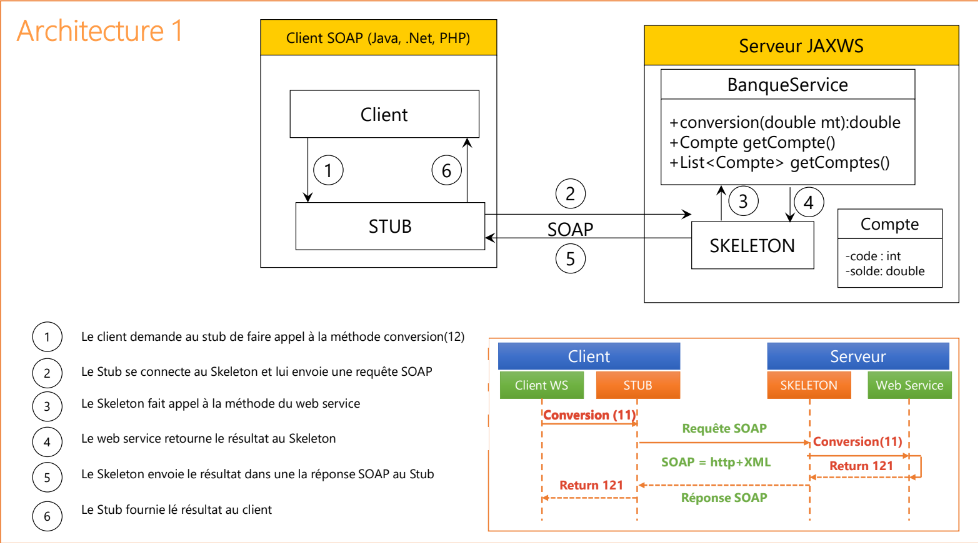
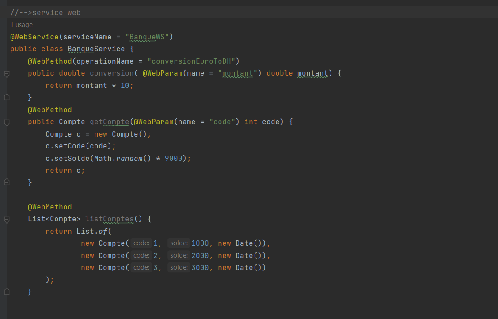
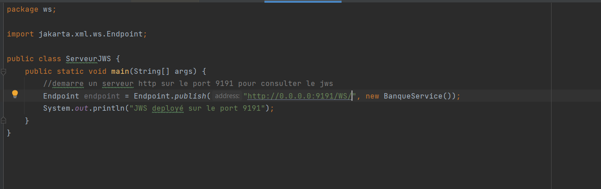
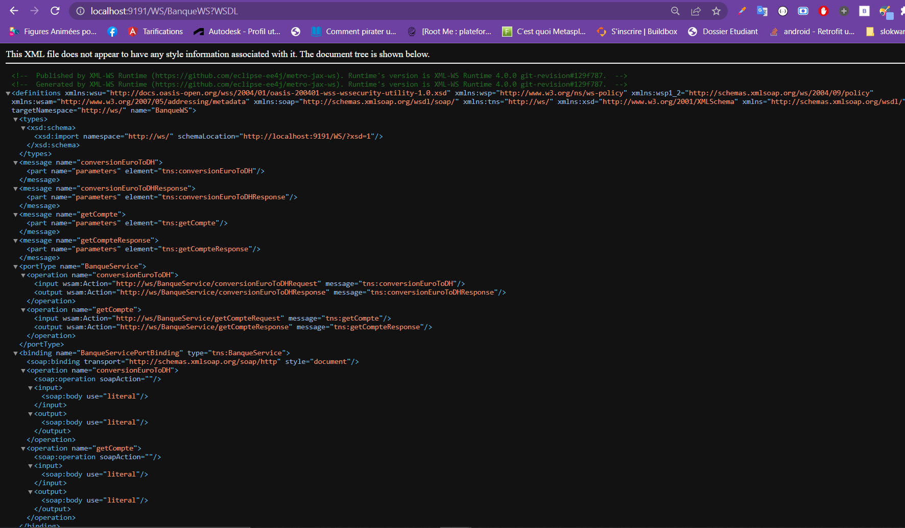
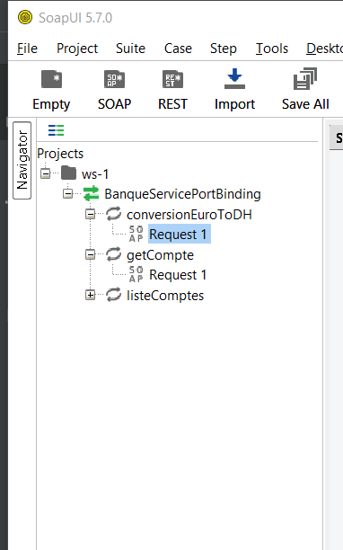
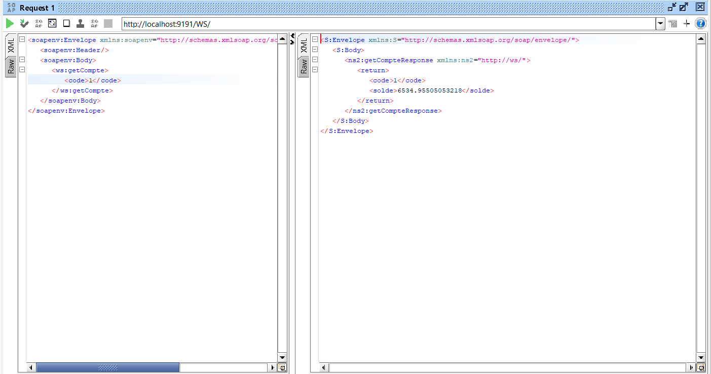
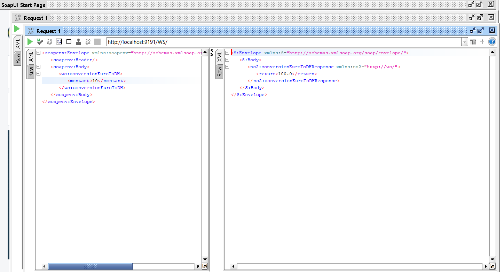
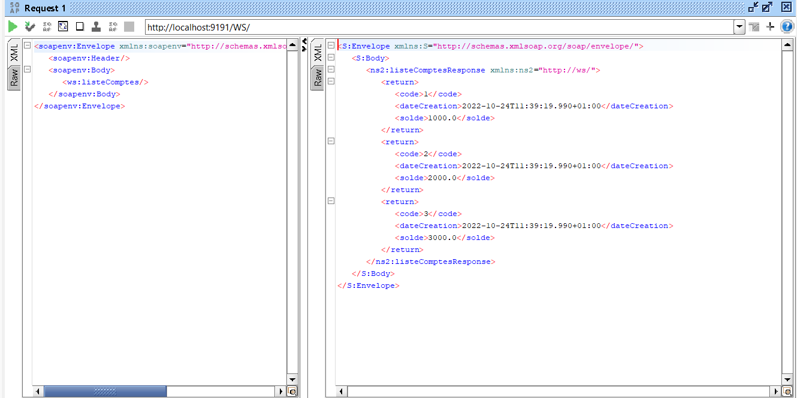
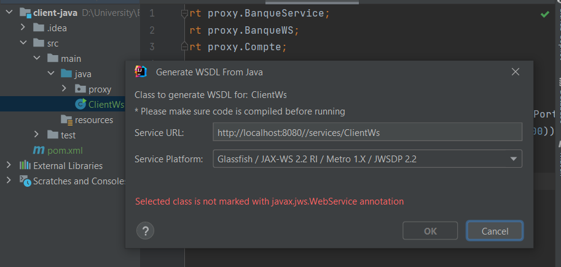
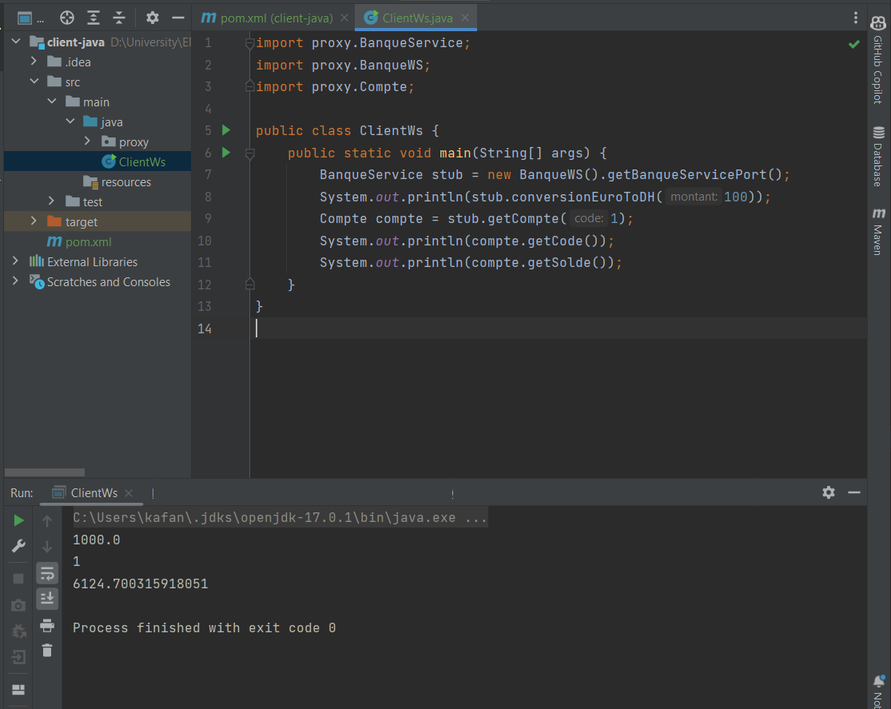

                                    Activité Pratique N° 3 : Web services SOAP, WSDL, UDDI avec JAXWS

                             Création d'un wep services Soap de gestion de compte

    1-Creation d'un webservice SOAP

    2- Deploiement du webservice SOAP

    3- Test du webservice SOAP Sur le Browser http://localhost:9191/WS/BanqueWS?wsdl

    4- Test du webservice SOAP sur soapUI

getCompte

conversionEuroToDh

listComptes

    5-Test du webservice SOAP sur le client java

    ==Création de proxy
    installation du pulgin WS sur intellij

    == Test du sur le client java
    

   
